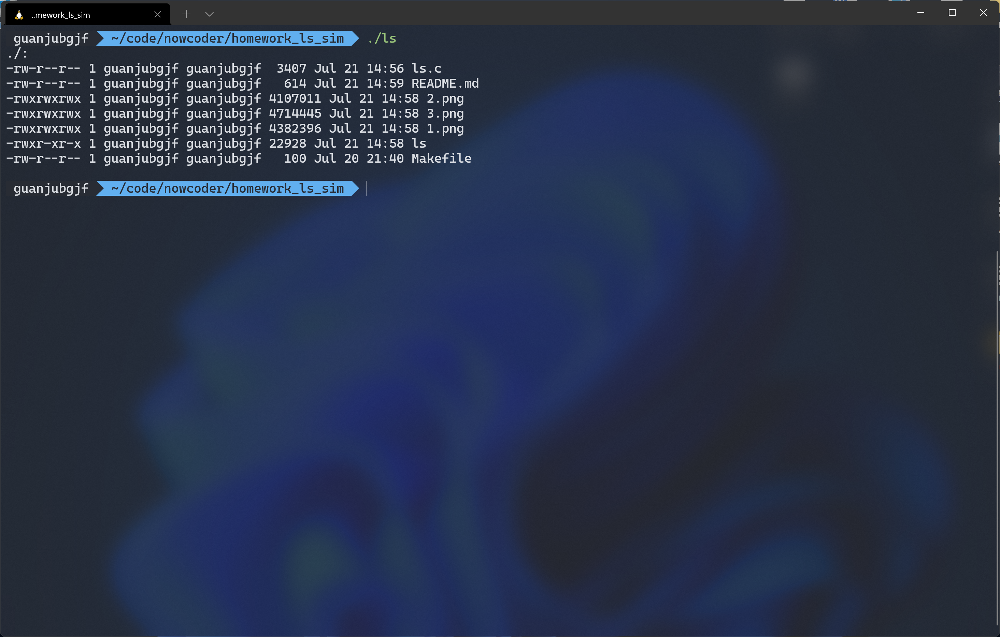
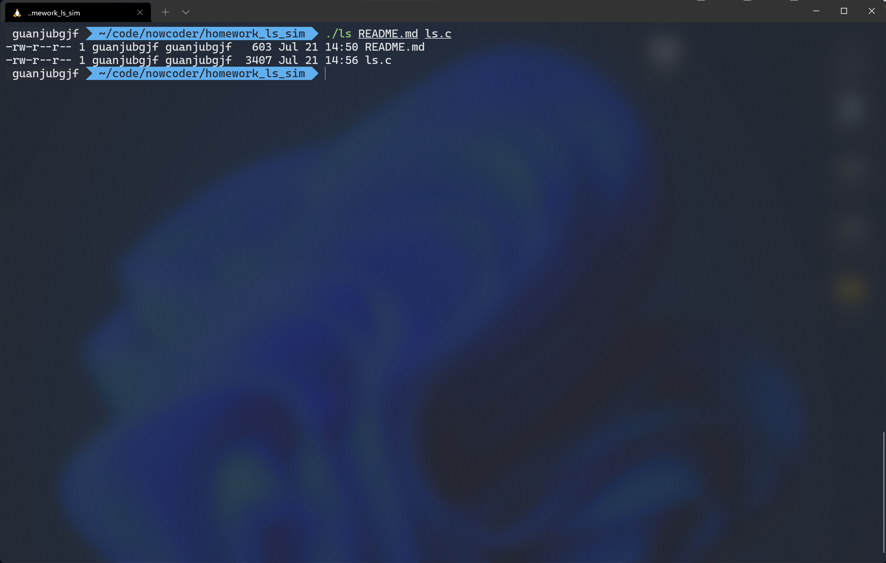

# 作业 2

## 功能说明

实现的 `ls` 功能是显示整个目录下的所有文件的信息，也可以只显示一个文件

## 用法

- `make` 即可编译
- `./ls` 为输出当前目录下的所有文件信息

- 支持对程序传入参数。
    - 指定目录: `./ls dir1/ dir2/` 可以输出 `dir1/` 和 `dir2/` 两个目录下的所有文件信息
    
    - 指定文件: `./ls file1 file2` 可以输出 `file1` 和 `file2` 两个文件的详细信息
    
    - 目录文件混合: `./ls file dir/` 可以输出 `file` 和 `dir/` 所有文件的信息
    
